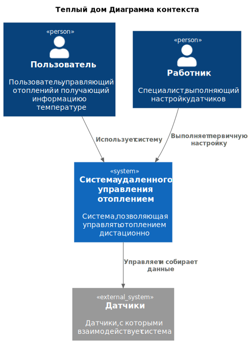
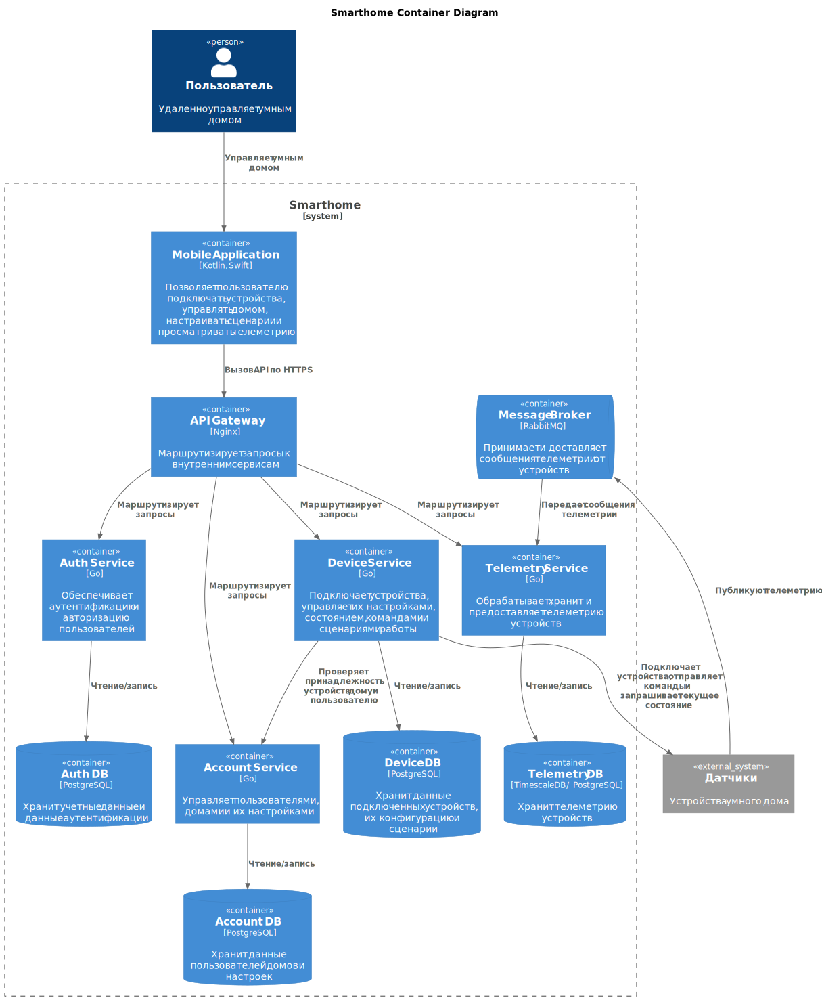
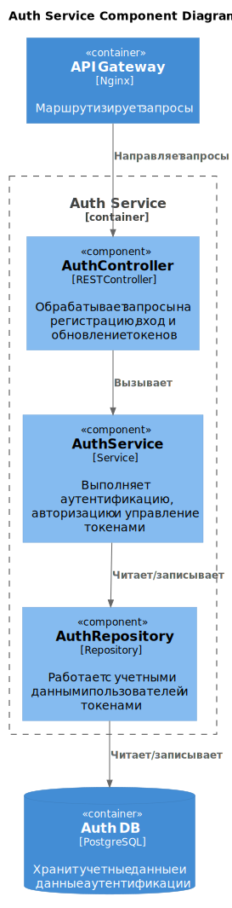
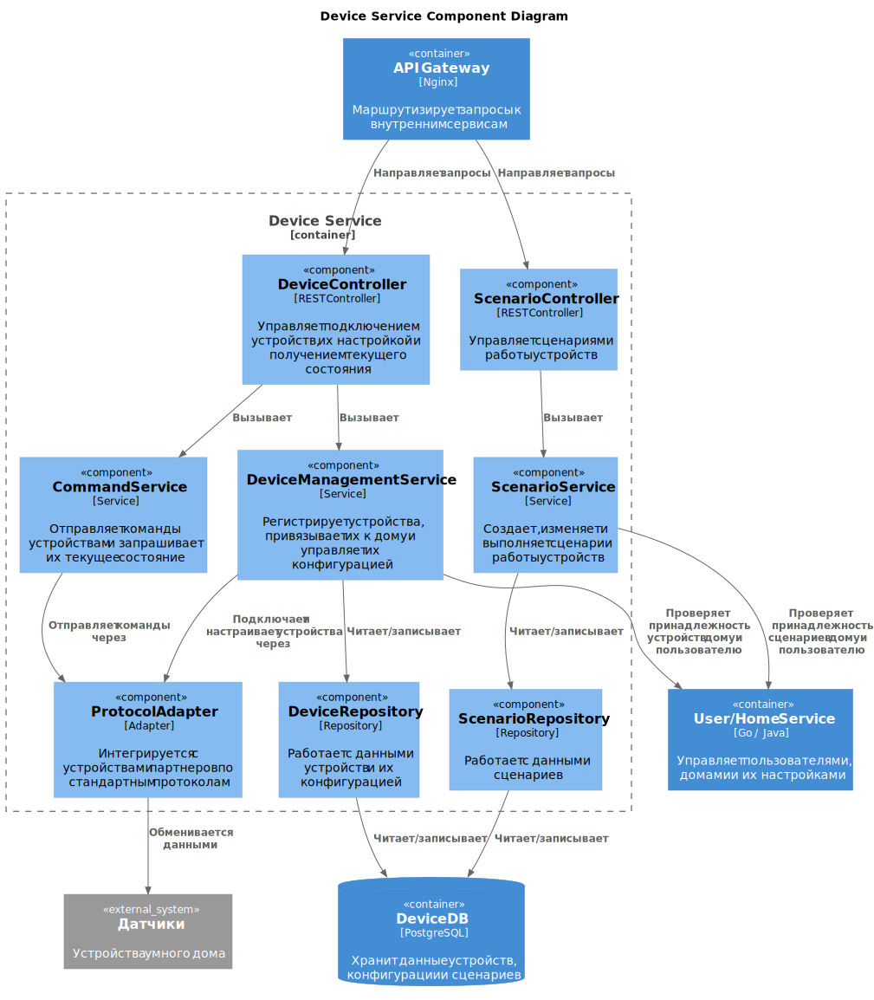
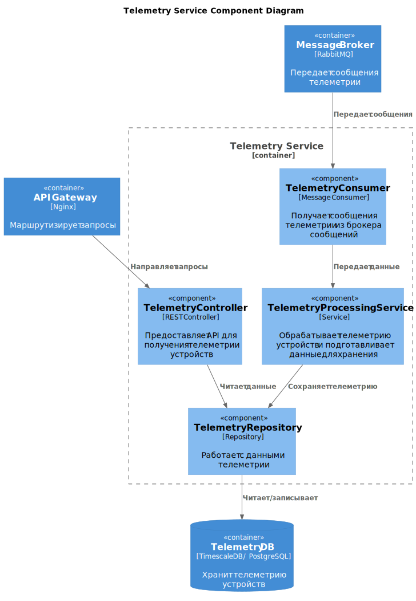
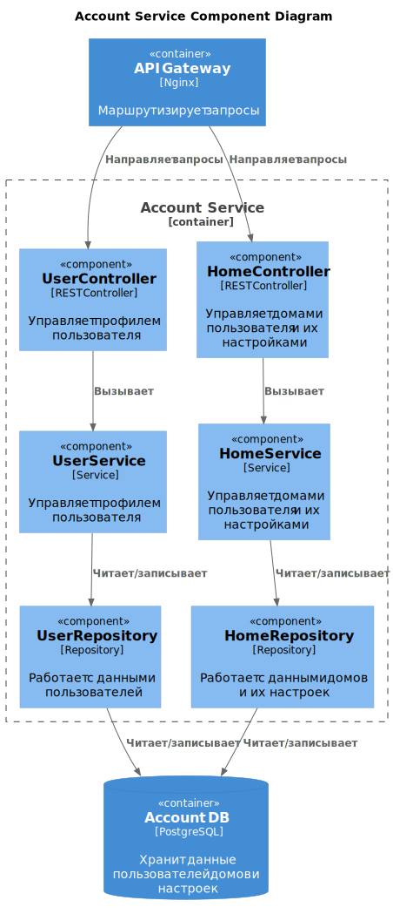
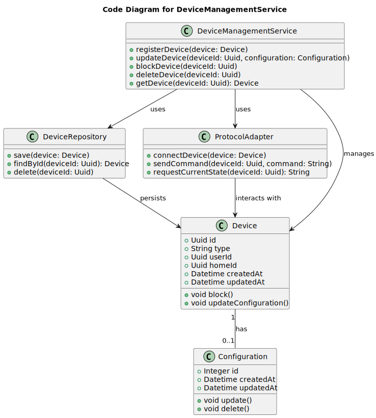
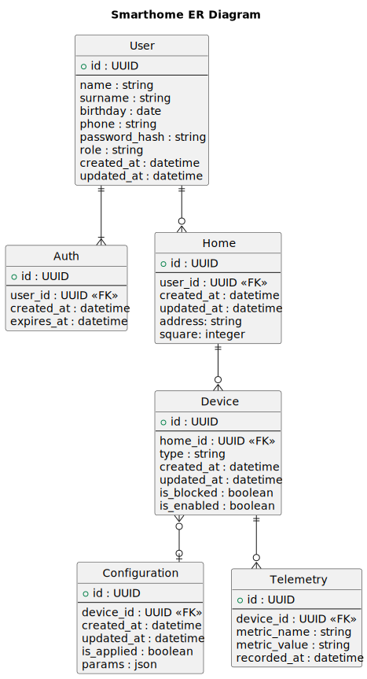

# Project_template

Это шаблон для решения проектной работы. Структура этого файла повторяет структуру заданий. Заполняйте его по мере работы над решением.

# Задание 1. Анализ и планирование

### 1. Описание функциональности монолитного приложения

**Управление отоплением:**

- Пользователь удаленно отправляет команду на изменение состояния отопления (вкл/выкл)
- Онбординг устройства возможен только силами специалиста, который физически устанавливает и регистрирует датчик 

**Мониторинг температуры:**

- Пользователи могут посмотреть температуру в своих домах через веб-интерфейс
- Система поддерживает получение температуры дома: сервер делает запрос к датчику, датчик отвечает

### 2. Анализ архитектуры монолитного приложения

- Монолит: Go + PostgreSQL
- Синхронные end-to-end вызовы (сервер - датчик, сервер - UI)
- Сервер ответственен за все функции. С ним могут взаимодействовать множество датчиков

### 3. Определение доменов и границы контекстов

- Домен: Удаленное управление отоплением 
- Контексты: 
 1. Регистрация устройства
 2. Управление отоплением
 3. Телеметрия (температура)

### **4. Проблемы монолитного решения**

Единая кодовая база и общий релизный цикл усложняет масштабирование (например, добавление удобной саморегистрации датчиков вместо выезда специалиста на место установки или добавление новых типов датчиков)

Наша дальнейшая задача - добавление новых возможностей, поэтому данное решение невалидно и требует другой архитектуры

### 5. Визуализация контекста системы — диаграмма С4




# Задание 2. Проектирование микросервисной архитектуры

В этом задании вам нужно предоставить только диаграммы в модели C4. Мы не просим вас отдельно описывать получившиеся микросервисы и то, как вы определили взаимодействия между компонентами To-Be системы. Если вы правильно подготовите диаграммы C4, они и так это покажут.

**Диаграмма контейнеров (Containers)**



**Диаграмма компонентов (Components)**






**Диаграмма кода (Code)**



# Задание 3. Разработка ER-диаграммы



# Задание 4. Создание и документирование API

### 1. Тип API

В архитектуре WarmHouse используются два типа API:

- **REST API (OpenAPI)** для синхронных запросов между API Gateway и сервисами, а также для межсервисных запросов
- **AsyncAPI (RabbitMQ)** для асинхронной доставки телеметрии по потоку `Sensors -> Message Broker -> Telemetry Service`

### 2. Документация API

OpenAPI спецификации REST-сервисов:

- Auth Service: `docs/api/auth-service.openapi.yaml`
- User/Home Service: `docs/api/account-service.openapi.yaml`
- Device Service: `docs/api/device-service.openapi.yaml`

AsyncAPI спецификация событий:

- Telemetry Events: `docs/asyncapi/telemetry-events.asyncapi.yaml`

# Задание 5. Работа с docker и docker-compose

Перейдите в apps.

Там находится приложение-монолит для работы с датчиками температуры. В README.md описано как запустить решение.

Вам нужно:

1) сделать простое приложение temperature-api на любом удобном для вас языке программирования, которое при запросе /temperature?location= будет отдавать рандомное значение температуры.

Locations - название комнаты, sensorId - идентификатор названия комнаты

```
	// If no location is provided, use a default based on sensor ID
	if location == "" {
		switch sensorID {
		case "1":
			location = "Living Room"
		case "2":
			location = "Bedroom"
		case "3":
			location = "Kitchen"
		default:
			location = "Unknown"
		}
	}

	// If no sensor ID is provided, generate one based on location
	if sensorID == "" {
		switch location {
		case "Living Room":
			sensorID = "1"
		case "Bedroom":
			sensorID = "2"
		case "Kitchen":
			sensorID = "3"
		default:
			sensorID = "0"
		}
	}
```

2) Приложение следует упаковать в Docker и добавить в docker-compose. Порт по умолчанию должен быть 8081

3) Кроме того для smart_home приложения требуется база данных - добавьте в docker-compose файл настройки для запуска postgres с указанием скрипта инициализации ./smart_home/init.sql

Для проверки можно использовать Postman коллекцию smarthome-api.postman_collection.json и вызвать:

- Create Sensor
- Get All Sensors

Должно при каждом вызове отображаться разное значение температуры

Ревьюер будет проверять точно так же.
